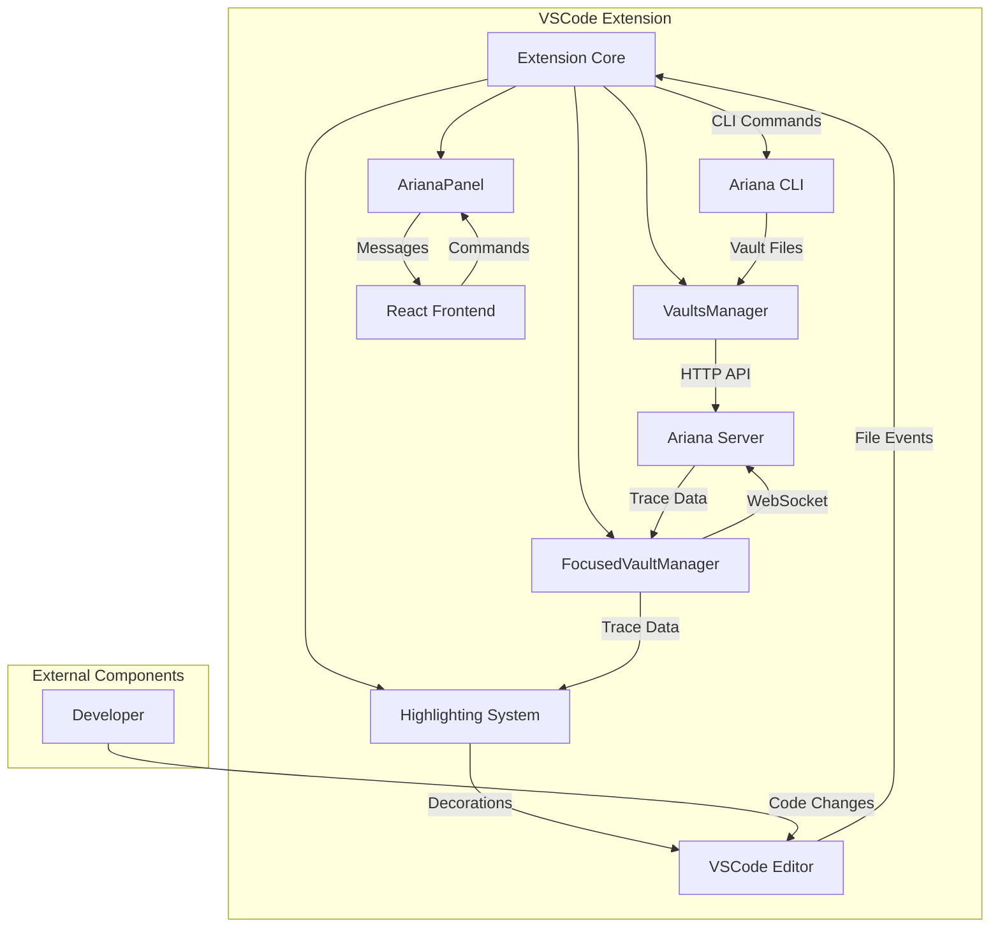

# Ariana VSCode Extension - Architecture Guide

## Overview - Complete Project Ecosystem

**Ariana** is an AI-powered debugging platform consisting of multiple interconnected components:

- **VSCode Extension** (this component) - IDE integration for developers
- **Ariana CLI** (Rust) - Command-line tool for project instrumentation and trace generation
- **Ariana Server** (Rust) - Backend API and WebSocket server for trace data management  
- **Landing Page** (SvelteKit) - Marketing and documentation website

The ecosystem enables developers to debug JavaScript/TypeScript/Python code by hovering over it or asking AI questions, with execution traces automatically collected and analyzed.

## Current Component: VSCode Extension

### Primary Purpose
The VSCode extension serves as the primary developer interface, providing:
- Real-time execution trace visualization in code editor
- AI-powered debugging assistance through sidebar interface
- Automated vault discovery and management
- CLI installation and management
- Code highlighting and navigation based on trace data

### Core Features
1. **Trace Highlighting** - Visual overlay of execution paths directly in source code
2. **Vault Management** - Automatic discovery and switching between debugging sessions
3. **CLI Integration** - Installation, updating, and status monitoring of Ariana CLI
4. **Real-time Updates** - Live WebSocket connection for streaming trace data
5. **Cross-platform Support** - Works on Windows, macOS, and Linux

### External Component Interactions

#### Ariana Server (Backend)
- **HTTP API Calls**:
  - `POST /unauthenticated/vaults/get-from-secret` - Fetch vault metadata
- **WebSocket Connections**: 
  - `ws(s)://api.ariana.dev/vaults/traces/{vault_key}/stream` - Real-time trace streaming
- **Configuration**: 
  - Development: `http://localhost:8080`
  - Production: `https://api.ariana.dev/`

#### Ariana CLI (Tool)
- **Command Execution**:
  - `ariana --version` - Version detection
  - Package manager commands for installation/updates
- **File System Integration**:
  - Reads `.ariana/.vault_secret_key` files for vault discovery
  - Monitors workspace folders for vault changes

#### Package Registries
- **npm**: Installation via `npm i -g ariana`
- **PyPI**: Installation via `pip install ariana`
- **Version checking**: Automated update detection

## Layer 1 Subcomponents (Core Modules)

### 1. Extension Core (`src/extension.ts`)
**Responsibilities**: 
- Extension lifecycle management
- Command registration and routing
- Event coordination between subsystems

**Key Dependencies**: All other Layer 1 components

### 2. Vault Management System
**Files**: `src/vaults/VaultsManager.ts`, `src/vaults/FocusedVaultManager.ts`
**Responsibilities**:
- Vault discovery via filesystem scanning
- Server communication for vault metadata
- WebSocket management for live trace streaming
- Vault switching and focus management

### 3. UI Panel System (`src/panels/ArianaPanel.ts`)
**Responsibilities**:
- Webview lifecycle management
- Extension ↔ React frontend message routing
- Theme and state synchronization

### 4. Code Highlighting System 
**Files**: `src/highlighting/` directory
**Responsibilities**:
- Trace data visualization in editor
- Code region decoration and hover providers
- Interactive trace navigation

### 5. CLI Management System (`src/installation/`)
**Responsibilities**:
- CLI installation and updates across package managers
- Version detection and compatibility checking
- Cross-platform command execution

### 6. React Frontend (`webview-ui/`)
**Responsibilities**:
- User interface for vault selection and settings
- Trace data display and interaction
- CLI status monitoring and installation workflows

## Layer 2 Subcomponents (Supporting Modules)

### Services Layer (`src/services/`)
- **WebviewService**: HTML generation, theme management, resource loading
- **HotReloadService**: Development-time UI refresh capabilities

### Data Layer (`src/bindings/`, `webview-ui/src/bindings/`)
- **Type Definitions**: Shared TypeScript interfaces for trace data
- **API Contracts**: Request/response types for server communication

### Utilities Layer
- **URI Helpers** (`src/urilHelpers.ts`): File path normalization
- **State Management** (`webview-ui/src/utils/stateManager`): Persistent UI state
- **Configuration** (`src/config.ts`): Environment-specific settings

### UI Components (`webview-ui/src/components/`)
- **MainTab**: Primary interface with vault selection and settings
- **VaultSelection**: Vault discovery and switching interface
- **OnboardingOpenable**: CLI installation workflow
- **UI Primitives**: Reusable components (toggles, accordions, etc.)

## Component Interaction Flow

## Feature Mapping to Components

### Trace Highlighting
- **Layer 1**: `HighlightingToggle`, `FocusedVaultManager` (data), Code highlighting system (visualization)
- **Layer 2**: Trace data types, region calculations, VSCode decorations API

### Vault Management  
- **Layer 1**: `VaultsManager` (discovery), `FocusedVaultManager` (active vault)
- **Layer 2**: File system utilities, HTTP client, WebSocket client

### CLI Integration
- **Layer 1**: CLI management system, UI panel
- **Layer 2**: Cross-platform command execution, package manager detection, installation workflows

### Real-time Updates
- **Layer 1**: `FocusedVaultManager` (WebSocket), UI panel (message routing)
- **Layer 2**: WebSocket client, throttling mechanisms, state synchronization

### User Interface
- **Layer 1**: React frontend, UI panel system
- **Layer 2**: Component library, state management, theme system

## Development Notes

### Build System
- **Extension**: TypeScript compiled with esbuild
- **Frontend**: React built with Vite
- **Watch Mode**: Concurrent building with `npm run watch`

### Key Design Patterns
- **Observer Pattern**: Event-based communication between vault managers and UI
- **Message Passing**: PostMessage API for extension ↔ webview communication  
- **Factory Pattern**: Dynamic CLI installation method selection
- **Throttling**: Trace updates batched to prevent UI flooding

### Error Handling
- **Network Failures**: Automatic WebSocket reconnection with exponential backoff
- **CLI Issues**: Graceful degradation with user-guided installation flows
- **Vault Errors**: Automatic cleanup of stale vault references

### Performance Considerations
- **Trace Throttling**: 800ms batching of incoming trace data
- **File System**: Limited directory traversal depth (10 levels, 5000 directories max)
- **Memory Management**: Automatic cleanup of WebSocket connections and event listeners

This architecture enables the VSCode extension to provide seamless debugging experience while maintaining clear separation of concerns and robust error handling across all integration points.
